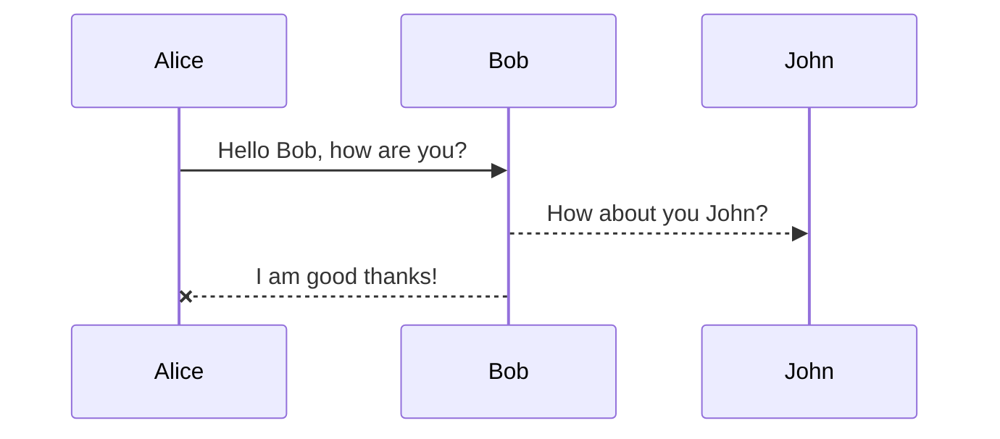

This is the eleventh and twelve-th week(5-16th Aug) of the coding period of GSoC where the main aim was to complete the whole pipeline and creating a nice UI for visualizing the flow of the pipeline.

## Table of Contents
